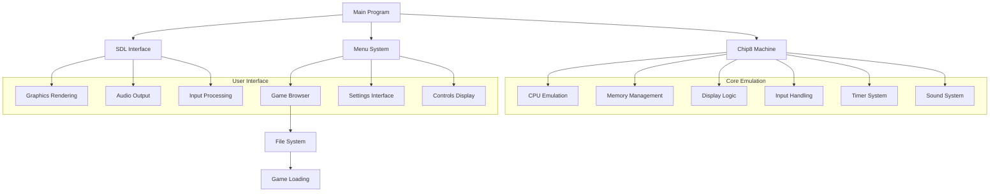

<div align="center">
  <h1>🎮 CHIP-8 Emulator in C</h1>
  <p>
    <strong>A professional, high-performance CHIP-8 emulator with modern features</strong>
  </p>
  <p>
    
    
    
    
  </p>
</div>

## 📋 Table of Contents
- [Overview](#-overview)
- [Key Features](#-key-features)
- [System Architecture](#-system-architecture)
- [CHIP-8 Technical Specifications](#-chip-8-technical-specifications)
- [Installation](#-installation)
- [Usage](#-usage)
- [Controls](#-controls)
- [Project Structure](#-project-structure)
- [Performance Optimizations](#-performance-optimizations)
- [License](#-license)

## 🔍 Overview

This CHIP-8 emulator is a professional-grade implementation in C that brings classic CHIP-8 games to modern systems. It features a sleek user interface, customizable settings, and robust emulation capabilities.

CHIP-8 is an interpreted programming language developed in the mid-1970s by Joseph Weisbecker, designed to make video game programming accessible on early microcomputers. This emulator faithfully recreates the CHIP-8 environment with modern enhancements, allowing you to experience these classic games as they were originally intended, but with improved usability.

<div align="center">
  
  
  
</div>

## 🌟 Key Features

- **High-performance emulation** with configurable CPU speed
- **Elegant menu system** for browsing and loading games
- **Directory navigation** to access games from any folder
- **Customizable display** with adjustable colors and scaling
- **Audio support** with volume control
- **Debugging capabilities** for development and learning
- **Cross-platform compatibility** (Linux, macOS, Windows)

## 🏗️ System Architecture

The emulator is designed with a modular architecture for maintainability and extensibility. Below is a diagram of the system components and their interactions:



### Component Descriptions

- **Main Program**: Orchestrates the emulation loop and manages the overall program flow
- **Chip8 Machine**: Implements the core CHIP-8 virtual machine
- **SDL Interface**: Handles graphics, audio, and input through the SDL2 library
- **Menu System**: Provides a user-friendly interface for selecting and launching games
- **File System**: Manages game file discovery and loading

## 📊 CHIP-8 Technical Specifications

The CHIP-8 is a virtual machine with the following specifications:

| Component | Specification | Description |
|-----------|---------------|-------------|
| **Memory** | 4KB (4096 bytes) | RAM available to programs |
| **Display** | 64×32 pixels | Monochrome display (black and white) |
| **Registers** | 16 × 8-bit | General purpose registers (V0-VF) |
| **Index Register** | 16-bit | Used to store memory addresses |
| **Program Counter** | 16-bit | Points to the current instruction |
| **Stack** | 16 × 16-bit | For subroutine calls (typically 12 levels) |
| **Timers** | 2 × 8-bit | Delay and sound timers that decrement at 60Hz |
| **Input** | 16 keys | Hexadecimal keypad (0-F) |
| **Sound** | 1-bit | Simple beep when sound timer is non-zero |
| **Instructions** | 35 opcodes | Each instruction is 2 bytes |

The original CHIP-8 interpreter included a set of 16 built-in sprites representing the hexadecimal digits 0-F. Each sprite is 5 bytes long, for a total of 80 bytes of memory.

### Instruction Set Overview

CHIP-8 has a simple but effective instruction set that includes:
- Arithmetic operations
- Conditional branching
- Memory operations
- Display drawing
- Input handling
- Timer manipulation

## 🔧 Installation

### Prerequisites

- C compiler (GCC or Clang)
- SDL2 library
- SDL2_ttf library
- Make build system

### One-Step Installation Script

For convenience, you can use our automated installation script:

```bash
./test-menu.sh
```

This script will:
1. Check for required dependencies
2. Install missing packages if needed (with your permission)
3. Compile the emulator
4. Run tests to ensure everything is working

### Manual Installation Steps

1. **Clone the repository**:
   ```bash
   git clone https://github.com/yourusername/Chip8-Emulator-in-C.git
   cd Chip8-Emulator-in-C
   ```

2. **Install the required dependencies**:

   **Ubuntu/Debian**:
   ```bash
   sudo apt-get update
   sudo apt-get install gcc libsdl2-dev libsdl2-ttf-dev
   ```

   **Fedora**:
   ```bash
   sudo dnf install gcc SDL2-devel SDL2_ttf-devel
   ```

   **Arch Linux**:
   ```bash
   sudo pacman -S gcc sdl2 sdl2_ttf
   ```

   **macOS (using Homebrew)**:
   ```bash
   brew install gcc sdl2 sdl2_ttf
   ```

   **Windows (using MSYS2)**:
   ```bash
   pacman -S mingw-w64-x86_64-gcc mingw-w64-x86_64-SDL2 mingw-w64-x86_64-SDL2_ttf
   ```

3. **Compile the emulator**:
   ```bash
   cd chip8-final
   make
   ```

## 🎮 Usage

### Starting the Emulator

To start the emulator with the enhanced menu interface:

```bash
./chip8-final/menu
```

### Using the Menu System

The menu provides an intuitive interface for:
- Browsing and selecting games from the `/games` directory and subdirectories
- Viewing control information
- Configuring emulator settings
- Exiting the emulator

**Navigation Controls**:
- **Arrow Keys**: Navigate through menu options
- **Enter**: Select the highlighted option
- **Escape**: Go back or exit

### Game Browser Features

The game browser allows you to:
- Navigate through folders and subfolders
- See a formatted list of available CHIP-8 games
- Easily return to parent directories
- Launch games with a single click

### Running a Game Directly

You can also run a game directly without using the menu:

```bash
./chip8-final/chip8 path/to/game.ch8
```

For example:
```bash
./chip8-final/chip8 games/Pong.ch8
```

## 🎛️ Controls

### Menu Controls
| Key | Function |
|-----|----------|
| **↑/↓** | Navigate menu options |
| **Enter** | Select option |
| **Escape** | Go back or exit |
| **Page Up/Down** | Scroll through long lists |

### Emulator Controls
| Key | Function |
|-----|----------|
| **Escape** | Quit the emulator |
| **Space** | Pause/Resume emulation |
| **H** | Reset the current game |
| **J/K** | Decrease/Increase color transition rate |
| **O/P** | Decrease/Increase volume |
| **N/M** | Increase/Decrease frame rate |

### Game Controls
The CHIP-8 uses a 16-key hexadecimal keypad. These keys are mapped to your keyboard as follows:

<div align="center">

```
CHIP-8 Keypad:     Keyboard Mapping:
+-+-+-+-+          +-+-+-+-+
|1|2|3|C|          |1|2|3|4|
+-+-+-+-+          +-+-+-+-+
|4|5|6|D|          |Q|W|E|R|
+-+-+-+-+    =>    +-+-+-+-+
|7|8|9|E|          |A|S|D|F|
+-+-+-+-+          +-+-+-+-+
|A|0|B|F|          |Z|X|C|V|
+-+-+-+-+          +-+-+-+-+
```

</div>

## 📁 Project Structure

```
Chip8-Emulator-in-C/
├── chip8-final/               # Main emulator code
│   ├── chip8.c                # Core emulator implementation
│   ├── menu.c/h               # Enhanced menu system
│   ├── initializing_chip8_machine.h  # CHIP-8 machine initialization
│   ├── initializing_config.h  # Configuration initialization
│   ├── input.h                # Input handling
│   ├── emulate.h              # Instruction emulation
│   ├── Draw_sprite.h          # Graphics rendering
│   ├── audio_callback.h       # Audio processing
│   ├── screen_update.h        # Display update logic
│   ├── update_timer.h         # Timer management
│   └── makefile               # Build configuration
├── games/                     # Directory for CHIP-8 ROMs
│   ├── Pong.ch8               # Example game
│   ├── Tetris.ch8             # Example game
│   └── ...                    # Other game files
├── README.md                  # Project documentation
└── test-menu.sh               # Installation and test script
```

### Core Components

- **Emulation Core**: Implements the CHIP-8 CPU, memory, and instruction set
- **Graphics System**: Handles rendering the CHIP-8 display to the screen
- **Input System**: Manages keyboard input and maps it to the CHIP-8 keypad
- **Audio System**: Provides sound output when the sound timer is active
- **Menu System**: Offers a user-friendly interface for browsing and launching games

## ⚡ Performance Optimizations

This emulator includes several optimizations for smooth performance:

- **Efficient rendering** with SDL2 hardware acceleration
- **Configurable CPU speed** to adjust for different games
- **Color transition smoothing** for improved visual quality
- **Audio buffering** for consistent sound output
- **Memory-efficient design** with minimal overhead

## 📜 License

This project is licensed under the MIT License - see the LICENSE file for details.

---

<div align="center">
  <p>Developed with ❤️ by a passionate retro gaming enthusiast</p>
  <p>© 2023-2025 All Rights Reserved</p>
</div>
